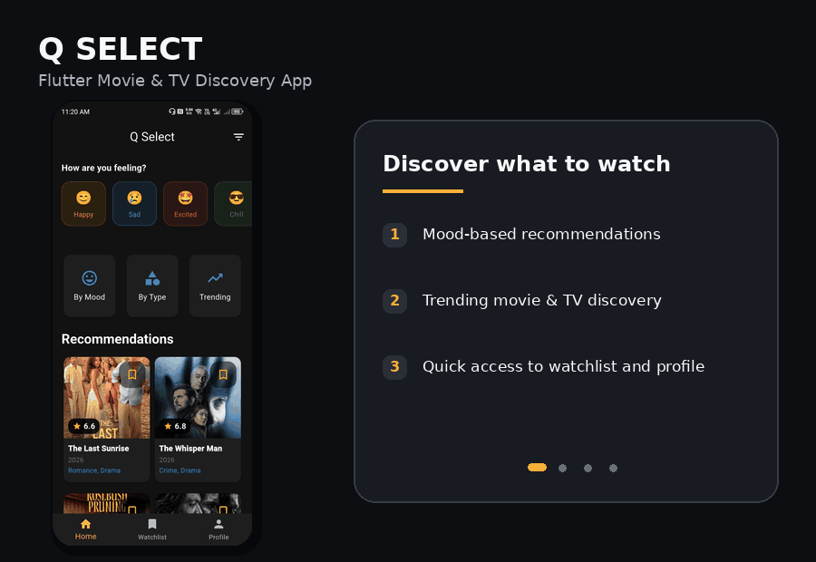
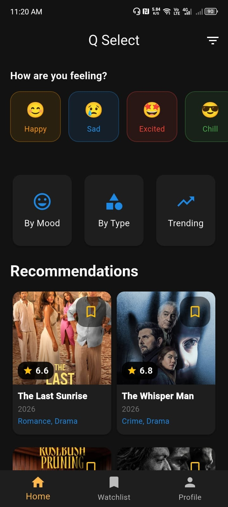
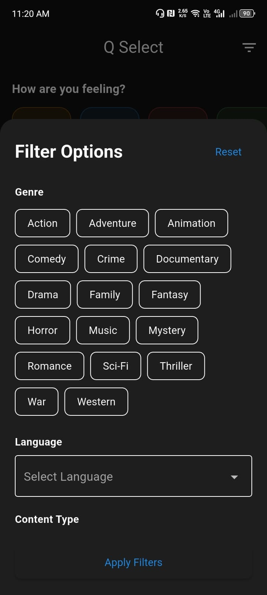
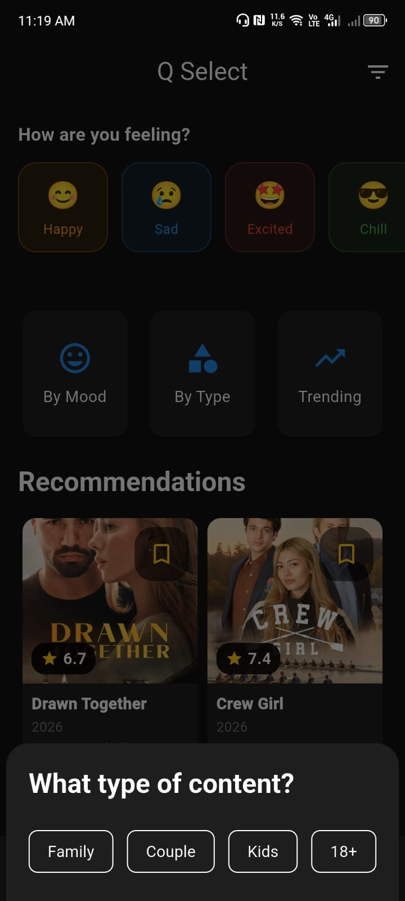
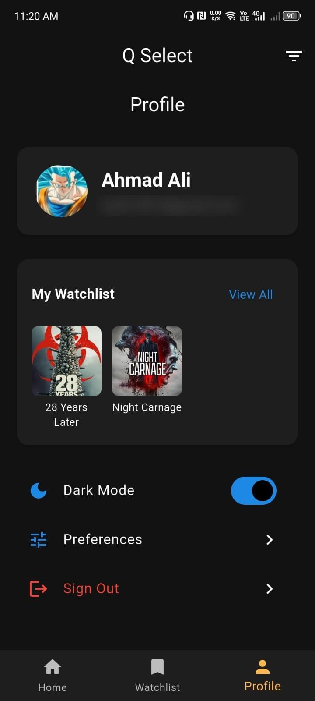

# 🎬 Flutter Movie & Series Discovery App

<p align="center">
  A Flutter movie and television discovery and recommendation application built to demonstrate mobile media discovery, local-first persistence, and cloud synchronization.
</p>

<p align="center">
  
  
  
  
  
</p>

---

## ✨ Features

- **Trending Discovery**: Browse trending movies and TV series fetched in real time.
- **Mood-Based Recommendations**: Explore curated content recommendations mapped to moods such as happy, chill, romantic, and excited.
- **Category & Genre Browsing**: Filter content across multiple movie and TV genres.
- **Movie & TV Filtering**: Search and filter titles by type, rating, and genre.
- **Local Watchlist**: Fast, offline-first watchlist powered by local SQLite (`sqflite`).
- **Firebase Authentication**: Email/password registration and sign-in.
- **Google Sign-In**: One-tap OAuth authentication using Google credentials.
- **Cloud Firestore Synchronization**: Cloud backup and cross-device sync of user watchlists with account-level isolation.
- **User Profile**: Profile management screen displaying account information and preferences.
- **Dark Mode**: System-aware and manual dark theme support.
- **Rich Media Details**: Detailed views with overview, cast, directors, release dates, and trailer links via `url_launcher`.

---

## 📱 App Showcase

<p align="center">
  
</p>

<p align="center">
  <sub>
    🎬 Animated showcase of Q Select — discovery, recommendations,
    filtering, preferences, profile, and watchlist experience.
  </sub>
</p>

<br>

<details>
<summary><b>🖼️ View All Screenshots</b></summary>

<br>

<table>
  <tr>
    <td align="center" width="50%">
      
      <br><br>
      <b>🏠 Home & Recommendations</b>
      <br>
      <sub>Mood discovery, trending content, and recommendations</sub>
    </td>
    <td align="center" width="50%">
      
      <br><br>
      <b>🔎 Filter Options</b>
      <br>
      <sub>Genre, rating, and discovery filtering</sub>
    </td>
  </tr>

  <tr>
    <td align="center" width="50%">
      
      <br><br>
      <b>🎭 Content Preferences</b>
      <br>
      <sub>Movie and TV content-type selection</sub>
    </td>
    <td align="center" width="50%">
      
      <br><br>
      <b>👤 Profile & Watchlist</b>
      <br>
      <sub>Account settings, dark mode, and saved titles</sub>
    </td>
  </tr>
</table>

</details>

<br>

> [!NOTE]
> The profile screenshot has the account email visually redacted for public portfolio use.

---
---

## 🧰 Tech Stack

- **Framework**: [Flutter](https://flutter.dev/) (Dart SDK `^3.8.1`)
- **State Management**: [Provider](https://pub.dev/packages/provider)
- **Networking**: [http](https://pub.dev/packages/http)
- **Remote API**: [The Movie Database (TMDB) REST API](https://developer.themoviedb.org/)
- **Backend & Auth**:
  - [Firebase Core](https://pub.dev/packages/firebase_core)
  - [Firebase Auth](https://pub.dev/packages/firebase_auth)
  - [Cloud Firestore](https://pub.dev/packages/cloud_firestore)
  - [Google Sign-In](https://pub.dev/packages/google_sign_in)
- **Local Persistence**:
  - [sqflite](https://pub.dev/packages/sqflite) (SQLite database)
  - [shared_preferences](https://pub.dev/packages/shared_preferences)
- **UI & Utilities**:
  - [cached_network_image](https://pub.dev/packages/cached_network_image)
  - [url_launcher](https://pub.dev/packages/url_launcher)

---

## 🚧 Project Status

This repository is a **restored learning and prototype project**.

- **Primary Target Platform**: **Android** is the primary tested and intended deployment target.
- **Cross-Platform Compatibility**: While Flutter supports iOS, Web, macOS, Linux, and Windows, those platforms have not been fully tested or configured for this project.
- **Recommendation Engine**: Recommendations are rule-based mappings of moods and categories to TMDB genres and curated queries; there is no machine learning or AI model in this project.

---

## 🎞️ TMDB Setup

TMDB API credentials are **not committed** to this repository. You must obtain your own free API key from [The Movie Database](https://www.themoviedb.org/documentation/api).

The application reads TMDB credentials at compile time using Dart environment variables (`--dart-define`).

### Required Variables

| Variable | Description |
|---|---|
| `TMDB_API_KEY` | Your TMDB v3 API Key |
| `TMDB_READ_ACCESS_TOKEN` | Optional TMDB v4 Read Access Token (Bearer Token) |

### Running with Credentials

**Windows (PowerShell / Command Prompt single line):**

```powershell
flutter run --dart-define=TMDB_API_KEY=YOUR_TMDB_KEY --dart-define=TMDB_READ_ACCESS_TOKEN=YOUR_TMDB_TOKEN
```

**macOS / Linux:**

```bash
flutter run \
  --dart-define=TMDB_API_KEY=YOUR_TMDB_KEY \
  --dart-define=TMDB_READ_ACCESS_TOKEN=YOUR_TMDB_TOKEN
```

> [!NOTE]
> If credentials are not supplied, the app will launch gracefully and display a missing-credentials notice in debug logs without crashing, but TMDB content requests will return empty results.

> [!WARNING]
> Using `--dart-define` keeps credentials out of the public source repository. However, client-side credentials compiled into a mobile binary can still be extracted by reverse engineering. For production systems, sensitive third-party API calls should be proxied through a secure backend service.

---

## 🔥 Firebase Setup

The application uses Firebase for Authentication (Email/Password & Google Sign-In) and Cloud Firestore for watchlist storage.

### Initialization Strategy

The project uses **native Android Firebase initialization** via `android/app/google-services.json`, processed by the Google Services Gradle plugin (`com.google.gms.google-services`), and invoked in `lib/main.dart` via `await Firebase.initializeApp()`.

### Configuring Your Own Firebase Project

1. Create a project in the [Firebase Console](https://console.firebase.google.com/).
2. Enable **Authentication** with **Email/Password** and **Google** providers.
3. Enable **Cloud Firestore** with appropriate security rules.
4. Add an Android app with package name `com.ahmadali.qselectapp` or change the `applicationId` in `android/app/build.gradle.kts` to your own.
5. Download your project's `google-services.json` and place it in `android/app/`.
6. For Google Sign-In, add your debug and release SHA-1 signing fingerprints to your Android app settings in Firebase Console, and configure the web client ID in `lib/providers/auth_provider.dart`.
7. Alternatively, run `flutterfire configure` to generate updated cross-platform Firebase options.

> [!NOTE]
> Client configuration files like `google-services.json` contain public client identifiers such as project IDs and client API keys, not private server secrets. Configuring your own project ensures access to your own Firebase Auth and Firestore instances.

---

## 🚀 Getting Started

### Prerequisites

- Flutter SDK (`3.8.1` or newer)
- Android Studio / Android SDK
- Java Development Kit (JDK 11 or newer)

### Installation

1. Clone the repository:

   ```bash
   git clone https://github.com/your-username/q_select.git
   cd q_select
   ```

2. Install dependencies:

   ```bash
   flutter pub get
   ```

3. Set up your TMDB credentials and Firebase project as described above.

4. Run the application:

   ```powershell
   flutter run --dart-define=TMDB_API_KEY=YOUR_KEY --dart-define=TMDB_READ_ACCESS_TOKEN=YOUR_TOKEN
   ```

---

## ⚠️ Known Limitations

- **Android Focus**: Configured and validated primarily for Android; other platforms require platform-specific setup and testing.
- **Rule-Based Recommendations**: Mood and type recommendations use fixed genre mapping rather than personalized ML algorithms.
- **Client-Side API Integration**: TMDB calls are made directly from the client; a production-ready application would typically proxy these calls through a backend server.
- **Offline Sync Queuing**: Local SQLite caches the active user's watchlist, but conflict resolution during simultaneous multi-device offline updates is not implemented.

---

## 🔐 Security Notes

- **Credential Separation**: All live TMDB keys and bearer tokens have been removed from source code and replaced with compile-time environment variables.
- **Auth Token Privacy**: Authentication tokens (`accessToken`, `idToken`, OAuth credentials) are handled strictly in memory by authentication providers and are never logged or printed.
- **Keystore & Build Isolation**: Android release signing keystores (`*.jks`, `*.keystore`), `key.properties`, local configuration (`local.properties`), and build directories (`build/`) are strictly excluded by `.gitignore`.
- **Account Isolation**: Watchlists in local SQLite are scoped to the authenticated user UID and cleared upon logout, preventing cross-account data leakage.

---

## 👨‍💻 Author

**Ahmad Ali**
